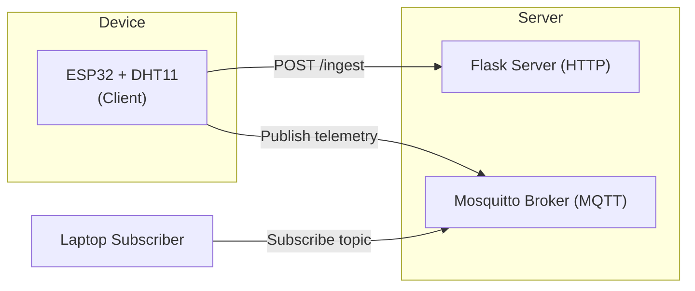

Here’s a proposed **README.md** for your repository **Esp32_Protokol** in English, Kak. Feel free to adapt or refine it as you see fit:

---

```markdown
# ESP32 IoT Protocol Examples

## Overview  
This repository serves as a collection of implementation examples using the ESP32 microcontroller and common IoT protocols. The purpose is to demonstrate end-to-end telemetry/data communication from device to server using two primary protocols:  
- **HTTP (REST API)** – sending sensor data to a server built with Flask  
- **MQTT (Publish/Subscribe)** – real-time communication using a broker (e.g., Eclipse Mosquitto)  

These examples are especially useful for academic labs, experiments with sensors (such as a DHT11), and prototyping IoT setups (ESP32 ↔ Laptop/Server).

---

## Project Structure  

```

praktikumiot/
├── http_server/
│   ├── server.py
│   └── .env
├── mqtt_broker/
│   └── docker-compose.yml
├── esp32/
│   ├── http_esp32_client_dht11.ino
│   ├── mqtt_esp32_publisher.ino
│   ├── mqtt_esp32_subscriber.ino
│   └── config.h
└── README.md

````

- **http_server/**: Contains a Flask-based HTTP server to ingest sensor data.  
- **mqtt_broker/**: Docker Compose configuration for setting up a Mosquitto MQTT broker.  
- **esp32/**: Arduino/PlatformIO sketch files for ESP32. Includes examples for HTTP client (DHT11 sensor) and MQTT publisher/subscriber.  
- **config.h**: Configuration header for WiFi, broker/server addresses, topics, etc.

---

## Getting Started

### 1. HTTP Server  
```bash
cd praktikumiot/http_server
export HTTP_HOST=0.0.0.0
export HTTP_PORT=8080
export CSV_PATH=ingest_log.csv
export TZ_OFFSET_MIN=420
python3 server.py
````

### 2. MQTT Broker (Docker)

```bash
cd praktikumiot/mqtt_broker
docker run -d \
  --name mosquitto \
  -p 1883:1883 -p 9001:9001 \
  -v $(pwd)/config:/mosquitto/config \
  -v $(pwd)/data:/mosquitto/data \
  -v $(pwd)/log:/mosquitto/log \
  eclipse-mosquitto:latest
```

### 3. ESP32 Device

* Upload `http_esp32_client_dht11.ino` to your ESP32 board.
* Upload `mqtt_esp32_publisher.ino` or `mqtt_esp32_subscriber.ino` as desired.
* Put your network credentials and broker/server addresses in `config.h`.

---

## System Architecture



In this architecture:

* The ESP32 sends temperature/humidity sensor data via HTTP POST to the Flask server.
* The ESP32 also publishes telemetry to the MQTT broker, and a laptop (or other subscriber) can subscribe to the topic to receive real-time data.

---

## Why This Project?

* Provides **hands-on examples** for IoT communication on ESP32 using real protocols.
* Ideal for **practical labs** or teaching IoT & embedded systems.
* Supports both REST-based and publish/subscribe models, covering fundamental IoT patterns.
* Easy to customize and extend (e.g., other sensors, edge logic, integration with cloud, dashboards).

---

## Future Enhancements

* Add TLS/SSL support for MQTT and HTTP for secure communication.
* Integrate sensor calibration and multiple sensor types.
* Add cloud integration (e.g., sending data to AWS IoT, Azure IoT, or Google Cloud).
* Build dashboard or mobile app for real-time visualization of telemetry.
* Add unit tests and CI pipeline for firmware and server code.

---

## Contributing

Contributions are welcome! Please feel free to open issues, suggest features, or submit pull-requests. When submitting code, please make sure:

* It is properly documented and commented.
* Any new dependencies are noted in `README.md`.
* Code follows consistent style and is tested.

---

## License

This project is licensed under the terms of the MIT License *(or replace with your preferred license)*.

---

## Contact

Maintained by **[Your Name / Ujang Bustomi ITTS]** – institute: Institut Teknologi Tangerang Selatan.
For questions or collaboration, please reach out via GitHub issues or via email (insert your contact email).

---

Thank you for exploring this repository! I hope it helps you learn and implement IoT systems with ESP32.

```

---


